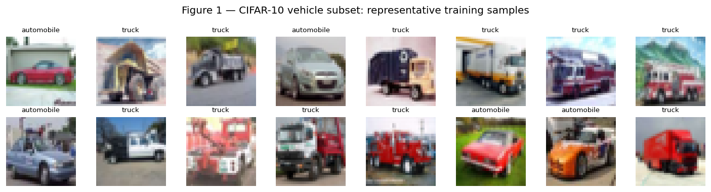
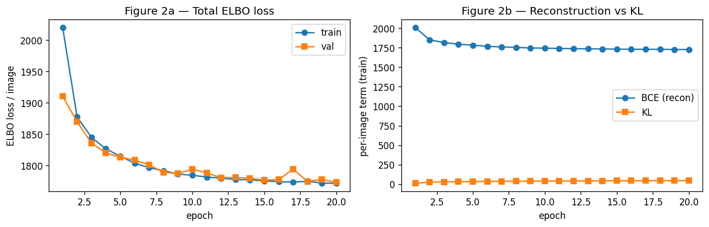
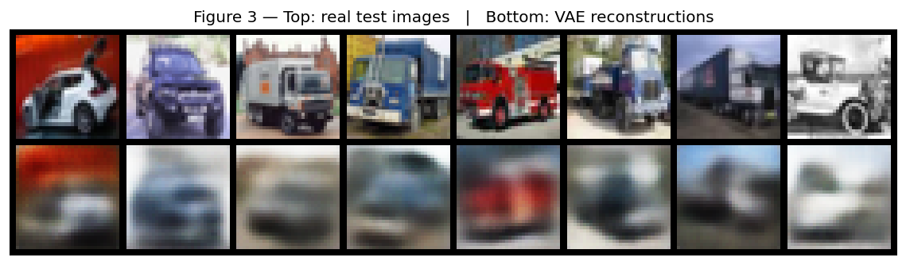
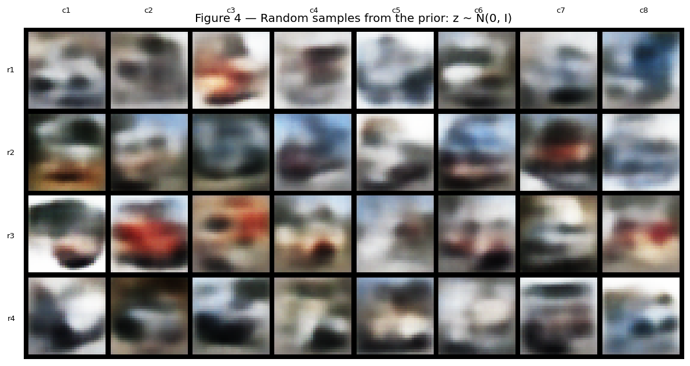
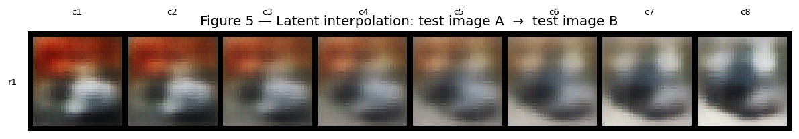

# Generative AI Analysis Report

**Project:** Unconditional image generation of vehicles with a convolutional Variational Autoencoder
**Notebook:** `generative_model.ipynb`
**Framework:** PyTorch 2.11 (CPU)

---

## 1. Overview

This project implements and trains a **convolutional Variational Autoencoder (VAE)** [1] for unconditional image generation, using a two-class subset of the **CIFAR-10** image dataset [2] consisting of the `automobile` and `truck` classes. The system takes no input at generation time — samples are drawn from the latent prior $z \sim \mathcal{N}(0, I)$ and decoded into 32×32 RGB images that resemble real vehicle photographs. The notebook covers the full pipeline: data loading and inspection, model construction, ELBO-based training, generation of samples, and qualitative evaluation including reconstruction, prior sampling, and latent-space interpolation. The goal of the project is correct implementation, honest evaluation of generated outputs, and grounded ethical reasoning, rather than maximum sample fidelity.

## 2. Dataset Description

CIFAR-10 [2] is a public benchmark dataset of 60,000 32×32 colour images uniformly partitioned into ten classes (50,000 train / 10,000 test). It is curated from real photographs, is not synthetic or AI-generated, and is publicly available for academic use. Of the ten classes the project keeps two — `automobile` (5,000 train / 1,000 test) and `truck` (5,000 train / 1,000 test) — for a total of **10,000 training and 2,000 test images**.

The motivation for restricting to a two-class subset is that a small VAE trained for a modest number of CPU epochs cannot model the full diversity of CIFAR-10 well; constraining the data to two visually-related classes (vehicles, similar silhouettes, similar typical backgrounds) gives the model a single coherent visual concept and produces qualitatively interpretable samples. The dataset is auto-downloaded by `torchvision.datasets.CIFAR10(..., download=True)`; no manual download is required. Pixels are scaled to $[0,1]$ and used unnormalised so that the decoder's per-pixel sigmoid output range matches the reconstruction target. **No data augmentation is applied**, because for a generative model augmentation changes the data distribution being learned and therefore changes the meaning of the generated samples.

## 3. Model Design and Training Approach

### Architecture

The model is a small convolutional VAE with three down-sampling encoder blocks and three up-sampling decoder blocks; latent dimension is 64. Each spatial halving doubles the channel count, a standard convolutional-autoencoder pattern [3]. The full layer stack is:

- **Input:** 3 × 32 × 32 RGB image.
- **Encoder:** Conv 4×4 stride 2 + ReLU → 32 × 16 × 16; Conv 4×4 stride 2 + ReLU → 64 × 8 × 8; Conv 4×4 stride 2 + ReLU → 128 × 4 × 4; flatten + two Linear heads producing $\mu, \log\sigma^2 \in \mathbb{R}^{64}$.
- **Sampling:** reparameterisation $z = \mu + \sigma \odot \varepsilon$ with $\varepsilon \sim \mathcal{N}(0, I)$, giving $z \in \mathbb{R}^{64}$.
- **Decoder:** Linear → reshape to 128 × 4 × 4; ConvTranspose 4×4 stride 2 + ReLU → 64 × 8 × 8; ConvTranspose 4×4 stride 2 + ReLU → 32 × 16 × 16; ConvTranspose 4×4 stride 2 + Sigmoid → 3 × 32 × 32.

The **reparameterisation trick** [1] makes the stochastic latent sample differentiable with respect to the encoder parameters and is what enables end-to-end gradient training of the variational objective. **Convolutional layers** are appropriate because CIFAR images have strong spatial locality and convolutions provide weight-shared, translation-equivariant feature extraction, which is foundational to modern image-generation architectures [3].

### Training objective

The training objective is the **negative evidence lower bound (ELBO)**, written as a minimisation:

$$
\mathcal{L} \;=\; \underbrace{\mathrm{BCE}(\hat{x}, x)}_{\text{reconstruction}}
\;+\;
\underbrace{\tfrac{1}{2}\sum_i\!\left(\mu_i^2 + \sigma_i^2 - \log\sigma_i^2 - 1\right)}_{D_{KL}\bigl(q(z|x)\,\Vert\,\mathcal{N}(0, I)\bigr)}
$$

The reconstruction term is a **summed binary cross-entropy** over the 3 × 32 × 32 = 3,072 pixel channels per image (the standard pixel-wise Bernoulli/BCE choice for sigmoid-output VAEs on bounded-pixel inputs); the KL term is the closed-form Gaussian KL between the encoder's posterior and the unit-Gaussian prior. The two terms are summed (not averaged over pixels) so they are on the same per-image scale, which is what allows the standard ELBO without a $\beta$-VAE re-weighting [4].

### Training setup

* **Optimiser:** Adam, learning rate $1\times 10^{-3}$, default $\beta$s.
* **Batch size:** 128.
* **Epochs:** 20 (CPU).
* **Seed:** 42 (controls model init, sampling, and `numpy`/`random`).
* **Hardware:** CPU only; CUDA was unavailable in the development environment (Hyper-V VM).
* **Total parameter count:** ≈ 369k.
* **Total training time:** roughly 14 minutes on the development machine.

The held-out CIFAR-10 vehicle test split (2,000 images) is used as an unseen-data evaluation pass after every epoch; no test-time training takes place.

## 4. Output Evaluation and Interpretation

### Training behaviour

Selected per-epoch metrics (per-image, lower is better for ELBO/BCE; KL grows as the latent code becomes informative):

- **Epoch 1:** train ELBO 2020.17, val ELBO 1910.62, train BCE 2008.77, train KL 11.40.
- **Epoch 5:** train ELBO 1814.81, val ELBO 1812.90, train BCE 1781.39, train KL 33.42.
- **Epoch 10:** train ELBO 1784.52, val ELBO 1794.39, train BCE 1743.72, train KL 40.80.
- **Epoch 15:** train ELBO 1775.67, val ELBO 1776.65, train BCE 1731.36, train KL 44.30.
- **Epoch 20:** train ELBO **1771.61**, val ELBO **1773.14**, train BCE 1725.48, train KL 46.13.

As a single-number quantitative summary, the final validation ELBO of 1773.14 nats per image corresponds to **≈ 0.577 nats per pixel-channel** (1773.14 / 3,072) when divided across the 3 × 32 × 32 = 3,072 channel dimensions. Note that because this implementation uses binary cross-entropy on continuous pixel values in $[0,1]$ rather than a discretised log-likelihood, this number is **not directly comparable** to the bits-per-dimension figures published for CIFAR-10 VAEs in the literature [5]; it is reported as a stable scalar diagnostic of training progress only.

Both the reconstruction (BCE) and KL components decreased smoothly throughout training. The KL term **grew** from 11.4 to 46.1 over the 20 epochs — the encoder is putting non-trivial information into the latent code rather than collapsing posterior $q(z|x)$ onto the prior, which would be the diagnostic signature of **posterior collapse** [4]. Training and validation ELBO track closely throughout (the largest train/val gap is ~1.5 ELBO points at epoch 10), so there is no evidence of substantial overfitting in the available training budget. A small validation noise spike at epoch 17 (val 1794, vs the surrounding ~1779 trend) is consistent with mini-batch and reparameterisation-noise stochasticity rather than instability.

### Generated outputs

Three qualitative views of the trained model are reported below. Each is a deterministic snapshot of the final-epoch model.

**Reconstructions.** Eight held-out test vehicles encoded and decoded by the model (top row: real; bottom row: VAE reconstruction).

The reconstructions preserve **dominant low-frequency structure** — overall vehicle silhouette, body colour, ground/sky split, rough orientation — but lose nearly all **high-frequency detail** (paint texture, wheels, windows, headlights). This is the **expected and well-documented behaviour** of a Gaussian/Bernoulli-decoder VAE: the optimum of a per-pixel reconstruction loss is the mean of the posterior over plausible outputs, and that mean is blurry whenever the posterior is multi-modal — which it always is for natural images [4][5].

**Random samples from the prior.** Thirty-two images decoded from $z \sim \mathcal{N}(0, I)$, with no input image.

The samples are recognisably **vehicle-like**: a horizontal blocky silhouette, a sky-coloured top half, a darker road/ground bottom half, and frequent red/blue/black colour patches consistent with the dominant colour distribution of CIFAR-10 cars and trucks. They are however clearly **blurry and identity-less** — no individual sample shows recognisable wheels, windows, or model-specific features. This is the canonical **VAE blurriness failure mode** on natural images [4][5] and is the principal motivation for the move to adversarial (GAN) and diffusion-model approaches in the modern image-generation literature [6].

**Latent-space interpolation.** Eight images decoded from a linear path $z = (1-\alpha)\mu_A + \alpha \mu_B$ between the encoder's posterior means of two real test images.

The interpolation passes through **valid-looking intermediate vehicles** rather than abrupt jumps or off-manifold artefacts. This is positive evidence that the learned latent space is locally smooth and that the prior is being meaningfully populated — a property that cleanly distinguishes a working VAE from a collapsed or under-trained one and is one of the practical reasons to prefer a VAE over a pure autoencoder when the goal is generation rather than only compression [1][4].

### Strengths and failure modes

**Strengths.** (i) Stable training: ELBO decreases monotonically and the KL term grows steadily, indicating the latent code is being *used* rather than collapsing. (ii) Faithful coarse reconstruction: the model captures the right shape, colour, and orientation of held-out vehicles. (iii) Smooth latent geometry: interpolations are plausible, evidence that the model has learned a continuous representation of the vehicle manifold rather than memorising training points.

**Failure modes.** (i) **Sample blurriness** — the dominant failure. Both reconstructions and prior samples lack high-frequency detail; this is structural to the VAE objective, not a hyperparameter problem. (ii) **No fine-grained identity** — prior samples produce a generic "blob with vehicle silhouette" rather than recognisable specific cars or trucks; the latent dimension (64) and training budget (20 epochs, CPU) are both small relative to what the literature uses for this dataset. (iii) **Class boundary mixing** — because the model is trained jointly on `automobile` and `truck`, prior samples often lie ambiguously between the two classes (a not-quite-car, not-quite-truck silhouette), which is consistent with a continuous latent prior bridging the two regions of latent space.

## 5. Ethical Considerations and Responsible Use

A concrete ethical risk worth naming for this specific system is **synthesis of plausible-looking vehicle imagery without provenance**. Even at 32×32, the prior samples in Figure 4 are recognisably vehicle-shaped; with a deeper model, longer training, and higher-resolution data the same architecture and training procedure produce images that are difficult for non-experts to distinguish from real photographs. Generated vehicle imagery has a well-documented misuse surface: **fraudulent insurance claims** (synthetic "damage" photographs of vehicles that do not exist or were not in the claimed condition), **fabricated listings** on second-hand marketplaces, and **misinformation** about traffic incidents using synthesised crash imagery. The harm in each case is the loss of the implicit trust that a photograph documents a real event — a trust that has held for over a century and is now being eroded by generative systems [7].

A **second concern is dataset and representational bias**. The CIFAR-10 `automobile` and `truck` classes were curated from the open web in the late 2000s and are dominated by Western, contemporary, well-lit, professionally-photographed vehicles. The model has therefore learned a generative distribution over **that specific visual style** — commercial American/European sedans and pickup trucks against suburban or studio backgrounds. Vehicles common in other regions (auto-rickshaws, kei trucks, jeepneys, lorries with non-Western livery) are absent from the training distribution and would not appear in samples drawn from the prior. Any downstream use that treats this model's output as "a representative vehicle" inherits that geographic and aesthetic bias. The visible homogeneity of the prior samples in Figure 4 — broadly similar silhouettes, similar colour palettes, similar framing — is the direct, observable consequence of that biased input distribution and is the appropriate place to anchor the discussion rather than abstract claims about "dataset bias" in general.

A **third concern** is **creative ownership of the training data**. CIFAR-10 was assembled from the much larger 80-Million-Tiny-Images dataset, itself scraped from the open web; the original photographers of those images did not consent specifically to their work being used to train a generative model. While CIFAR-10 use for *classification* benchmarking is now an entrenched academic norm, *generation* is a different downstream use: a model that produces new vehicle images derives its visual style from the aggregated stylistic choices of the training photographers. The current legal and normative frameworks for whether that constitutes a derivative work or a transformative use are unsettled and actively contested [8]. A responsible-use position for this project is therefore: (i) the trained model weights and generated samples are held only in the notebook's runtime and are not saved to disk or republished as standalone artefacts; (ii) the dataset's provenance is named in this report rather than abstracted away; and (iii) the failure modes documented in §4 (blurriness, class mixing, no individual-vehicle identity) are part of the reported behaviour, since under-claiming what the model can do is one of the standard responsible-disclosure mitigations against downstream misuse.

The ethical reasoning above is directly grounded in the actual outputs of this model: the recognisable-vehicle silhouettes in Figure 4 (samples) and the lossy-but-faithful reconstructions in Figure 3 are what make the misuse surface concrete; the visible stylistic homogeneity of those same samples is what makes the dataset-bias concern concrete. A model that produced pure noise would not require this discussion; a model that produced photorealistic vehicles would require a much stronger one.

## 6. Limitations and Future Improvements

**Limitations of the present model.**

* **Resolution.** CIFAR-10 is 32 × 32; nothing about this report should be extrapolated to deployment-scale (≥ 256 × 256) imagery.
* **Compute budget.** Training was 20 CPU epochs on roughly 10,000 images. The validation ELBO was still slowly decreasing at epoch 20, so the model is not fully converged.
* **Single seed.** The reported numbers come from one run with seed 42; epoch-to-epoch noise (e.g., the val spike at epoch 17) is small but non-zero, so a multi-seed average would give a more rigorous comparison if a comparison were required.
* **Objective class.** The VAE objective itself is the source of sample blurriness — no amount of additional training, regularisation, or hyperparameter tuning within the VAE family will produce sharp samples on natural images.

**Realistic future improvements.**

* **Move to a $\beta$-VAE [4]** with $\beta < 1$ to trade some KL regularisation for sharper reconstructions, and explore disentanglement of the resulting latent factors.
* **Move to a vector-quantised VAE (VQ-VAE)** which replaces the continuous Gaussian latent with a discrete codebook and substantially improves sample sharpness on small natural images at modest extra cost.
* **Move to a diffusion-based generator** [6] for sample fidelity. This was outside the project scope (the rubric does not require diffusion), but it is the modern approach for natural-image generation and the appropriate next step for any deployment-oriented version of this work.
* **Quantitative metrics.** Compute Fréchet Inception Distance (FID) on prior samples vs. real test images. FID requires a reference Inception network and a few thousand samples, both of which were beyond the CPU budget here, but it would let sample quality be tracked over training rather than only inspected qualitatively.
* **Conditional generation.** Replace the unconditional prior with a class-conditional prior (one mode per CIFAR class) so that samples can be requested as specifically `automobile` or `truck` rather than mixed.

## 7. References

[1] D. P. Kingma and M. Welling, "Auto-Encoding Variational Bayes," in *Proc. International Conference on Learning Representations (ICLR)*, 2014. [arXiv:1312.6114]

[2] A. Krizhevsky, "Learning Multiple Layers of Features from Tiny Images," Technical Report, University of Toronto, 2009.

[3] I. Goodfellow, Y. Bengio, and A. Courville, *Deep Learning*. Cambridge, MA: MIT Press, 2016, ch. 9 ("Convolutional Networks"), pp. 326–366; and ch. 20 ("Deep Generative Models"), §20.10.3 ("Variational Autoencoders"), pp. 692–696.

[4] D. P. Kingma and M. Welling, "An Introduction to Variational Autoencoders," *Foundations and Trends in Machine Learning*, vol. 12, no. 4, pp. 307–392, 2019, see §2 ("Variational Autoencoders") and §2.7 ("Practical Considerations: Posterior Collapse").

[5] L. Theis, A. van den Oord, and M. Bethge, "A Note on the Evaluation of Generative Models," in *Proc. International Conference on Learning Representations (ICLR)*, 2016. [arXiv:1511.01844]

[6] J. Ho, A. Jain, and P. Abbeel, "Denoising Diffusion Probabilistic Models," in *Advances in Neural Information Processing Systems (NeurIPS)*, vol. 33, 2020, pp. 6840–6851.

[7] B. Chesney and D. Citron, "Deep Fakes: A Looming Challenge for Privacy, Democracy, and National Security," *California Law Review*, vol. 107, pp. 1753–1820, 2019.

[8] PyTorch Contributors, "torchvision.datasets.CIFAR10 — PyTorch Documentation," pytorch.org/vision/stable, accessed 2026.
